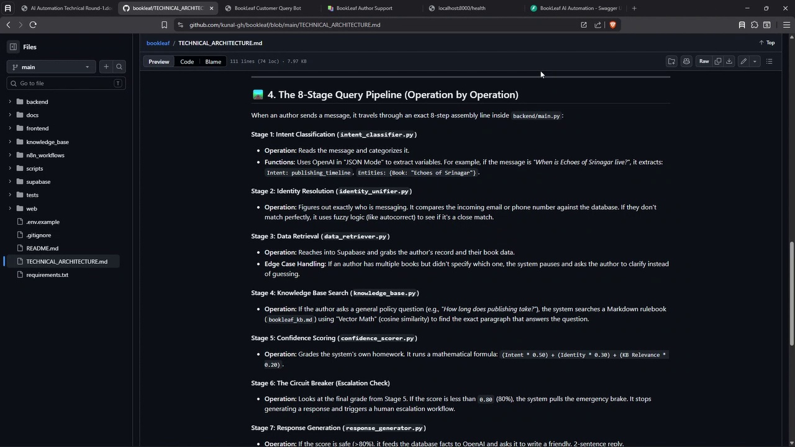

<div align="center">

# 📚 BookLeaf Publishing — AI Support Automation Suite

**An intelligent, production-ready hybrid automation suite designed to streamline BookLeaf's author support queries across various communication channels.**

[](https://fastapi.tiangolo.com/)
[](https://supabase.com/)
[](https://openai.com/)
[](https://n8n.io/)
[](https://python.org/)

*Developed for the AI Automation Specialist Technical Assignment*

</div>

---

## 🎯 Task Requirements Mapping

The system has been designed from the ground up to fulfill every core and intermediate requirement of the assignment, combining system design, no-code/low-code orchestration, and cutting-edge LLM integration.

### 🌟 Core Requirements
- [x] **Accept natural language questions:** Handles dynamic inquiries like *"Is my book live yet?"*, *"When will I get my royalty?"*, and *"Where's my author copy?"* seamlessly through intent classification.
- [x] **Match queries to relevant data in a Supabase-like DB:** Real-time data retrieval fetches exact publishing timelines, royalty statuses, and dispatch dates.
- [x] **Respond with appropriate status and date:** OpenAI drafts professional, context-aware responses incorporating the mocked DB data.
- [x] **Integrate Knowledge Base:** An in-memory vector RAG pipeline handles generic policy questions (e.g., publishing timelines, dashboard access) using cosine similarity.
- [x] **Confidence < 80% Circuit Breaker:** A rigorous composite formula calculates confidence. If the score falls below 80%, the system halts AI response generation and seamlessly escalates to a human agent.
- [x] **Log all queries and responses:** Every interaction, including its confidence score and escalation status, is permanently logged to the `query_logs` Supabase table.
- [x] **Use OpenAI (or any LLM):** `GPT-4o-mini` is utilized for intent extraction, natural language response generation, and borderline identity verification. `text-embedding-3-small` handles KB vectorization.
- [x] **Connect with Supabase (with mocked data):** Integrated with Supabase PostgreSQL. A local "Mock Mode" is also provided for seamless offline evaluation without API keys.
- [x] **Implement error handling:** Defensive try/except blocks handle Supabase outages, unmatched authors, multiple book ambiguities, and OpenAI API failures gracefully by triggering safe human fallbacks.
- [x] **Format output in a chat-like interface:** A beautiful, responsive Web UI (`/app`) is included alongside standard REST endpoints to visually demonstrate capabilities.

### 🔗 Intermediate Task: Identity Unification Logic
- [x] **Link all platforms to a single profile:** Merges Email, WhatsApp (Phone), Dashboard Name, and Instagram Handle into unified Author IDs.
- [x] **Fuzzy Logic & LLMs:** Uses `rapidfuzz` for C-optimized name similarity and GPT-4o-mini for arbitration on borderline matches.
- [x] **Highlight confidence scores:** Identity resolution generates distinct confidence scores (e.g., 100%, 85%, 45%).
- [x] **Fallback / Verify Manually:** Matches between 60%-84% confidence are queued into an `identity_mappings` admin table for human review.

---

## 🏗️ System Architecture

The project employs a **hybrid architecture** that balances low-code/no-code operational flexibility (n8n Cloud) with granular code-level control for intelligence, fuzzy logic, and database operations (FastAPI and Supabase).

<div align="center">
  
</div>

### 🧩 Module Breakdown
1. **Channel Gateway (n8n Cloud):** Acts as the omni-channel intake valve. It normalizes incoming webhooks (from WhatsApp, Instagram, Email) and routes them to the API Brain. It also handles the final 80% confidence gate to route to human agents if needed.
2. **API Brain (FastAPI):** The core intelligence engine. It orchestrates the 8-stage processing pipeline in milliseconds. FastAPI was chosen to allow strict typing, Python-native fuzzy matching (`rapidfuzz`), and high-performance vector math (`NumPy`).
3. **Database (Supabase PostgreSQL):** Acts as the single source of truth for author profiles, book statuses, knowledge base vectors (simulated), and audit logs.
4. **LLM Orchestration (OpenAI GPT-4o-mini):** Handles heavy cognitive lifting. It is used in structured JSON mode for Intent Classification and Identity Arbitration, and in standard mode for Response Generation.

---

## 🧠 The 8-Stage Query Processing Pipeline

When a user submits a query via `POST /chat`, the system executes a rigorous 8-stage pipeline to guarantee safety and accuracy:

1. **Intent Classification:** GPT-4o-mini parses the raw text and extracts the core intent (e.g., `publishing_timeline`, `royalty_status`) and any entities (like Book Title).
2. **Identity Resolution:** Unifies incoming identifiers (Email, Phone, Name, Instagram) against the database using the 3-Tier Identity Pipeline (detailed below).
3. **Data Retrieval:** If the intent requires record-level data, queries Supabase for the resolved Author ID and their associated books. Ambiguities are handled interactively.
4. **Knowledge Base Search (RAG):** If the query is a general policy question, it is vectorized using `text-embedding-3-small` and matched against the Markdown Knowledge Base using NumPy cosine similarity.
5. **Confidence Scoring:** A weighted mathematical formula evaluates the reliability of the retrieved data, the identity match, and the LLM intent.
6. **Escalation Check (Circuit Breaker):** If the final confidence is $< 80\%$, database errors occur, or hostile language is detected, the pipeline immediately diverts to a human fallback.
7. **Response Generation:** GPT-4o-mini synthesizes a warm, professional, 2-4 sentence response combining the retrieved data and KB context.
8. **Audit Logging:** The entire interaction, including the raw query, generated response, intent, and confidence score, is committed to the `query_logs` table.

---

## 🔍 Identity Unification (Intermediate Task Solution)

Authors often interact across disparate platforms. Our system unifies these fragmented profiles using a highly dynamic **Three-Tier Pipeline**:

<div align="center">
  
</div>

### 📊 The Three Tiers:
1. **Tier 1 — Auto Match ($\ge 80\%$ Base Score):** Instantly links the incoming query to the database profile using a weighted scoring system (Email: 35 pts, Phone: 30 pts, Name Fuzzy: 25 pts, Instagram: 10 pts).
2. **Tier 2 — Borderline Arbitration ($40-79\%$):** When a score falls into the "maybe" zone, the system triggers a secure GPT-4o-mini evaluation. The LLM compares the full profiles and produces a probabilistic match score.
   - 🟢 If prob $\ge 0.85 \rightarrow$ System automatically links (`auto_link`).
   - 🟡 If prob $0.60 - 0.84 \rightarrow$ System flags for manual review (`verify_manually`).
3. **Tier 3 — Create New ($< 40\%$):** If no meaningful match is found, the system safely provisions a provisional author profile to prevent cross-contamination.

---

## ⚙️ The 80% Confidence Circuit Breaker

To prevent hallucinated support answers or incorrect data exposure, we use a rigid, weighted composite formula:

> **$\text{Confidence Score} = 0.50 \times \text{Intent} + 0.30 \times \text{Identity} + 0.20 \times \text{KB Relevance}$**

**Critical Safety Rules:**
* **General FAQs:** If the query doesn't require personal data, Identity Confidence is bypassed (set to `1.0`).
* **The 80% Floor:** If the final calculated score falls below `0.80`, the AI response is immediately scrapped. A standardized human-handoff message is returned.
* **Exception Flags:** Any internal error (Supabase timeout, OpenAI rate limit, etc.) automatically drops the confidence to `0.0`.

---

## 🛡️ Error Handling & Fallback Matrices

Defensive execution is baked into every module. The system never crashes; it gracefully degrades to human support.

| Scenario | Detection Location | Fallback Behavior | User Message |
|----------|-------------------|-------------------|--------------|
| 🚨 **Supabase Unreachable** | `data_retriever.py` | Traps exception, aborts pipeline, triggers immediate escalation. | *"I'm unable to access your records right now. Connecting you to a human agent..."* |
| 👤 **No Author Match Found** | `main.py` | Sets `identity_conf = 0.0`. Total score plummets below 0.80, forcing handoff. | *"I want to make sure you get the most accurate help. I've escalated your query..."* |
| 📚 **Multiple Books Ambiguity** | `main.py` | Detects >1 books linked. Bypasses escalation to ask a clarifying question. | *"I found multiple books under your account: [Titles]. Which one are you asking about?"* |
| 🔌 **OpenAI API Outage** | `main.py` | Standard `try/except` blocks catch timeouts, falling back to instant human escalation. | *"I'm unable to answer that right now. Connecting you to a human agent..."* |
| 😡 **Hostile/Angry Tone** | `intent_classifier.py` | LLM classifies intent as `escalate_human`. Confidence is forced to 0.0. | Handed off to human immediately to de-escalate. |

---

## 💻 Setup & Local Testing

The project includes a stunning, purpose-built Web UI to evaluate the system without needing third-party API tools.

### Prerequisites
* Python 3.9+
* Git

### Installation
```bash
# 1) Clone the repository
git clone https://github.com/kunal-gh/bookleaf.git
cd bookleaf

# 2) Install dependencies
pip install -r requirements.txt

# 3) Start the FastAPI Server
uvicorn backend.main:app --reload --host 0.0.0.0 --port 8000
```

> [!TIP]
> **Mock Mode Evaluation:** Reviewers can test the entire logic pipeline instantly! If you don't supply an `.env` file (or set `OPENAI_API_KEY=test`), the system engages a highly advanced "Mock Mode" using deterministic matching and an in-memory mock database that mirrors Supabase perfectly. No API keys required!

> [!IMPORTANT]  
> **🚀 Public Deployment Ready (Vercel) & Plug-and-Play AI:**  
> This project is structurally designed so it can be instantly deployed on **Vercel** for a public URL that anyone can try! Furthermore, our LLM integration is completely **plug-and-play**. To switch from Mock Mode to Live Mode, simply drop an active `OPENAI_API_KEY` into the `.env` file. The API Brain will instantly connect to OpenAI and utilize live RAG and intent classification. No code changes required!

### Evaluation Endpoints
Once the server is running, navigate to:
- **Interactive Web Demo:** [http://localhost:8000/app/](http://localhost:8000/app/) (Features Chat, Identity Sandbox, and Admin Review Queue).
- **API Swagger Docs:** [http://localhost:8000/docs](http://localhost:8000/docs)
- **Health Check:** [http://localhost:8000/health](http://localhost:8000/health)

---

## 🔄 n8n Integration

The n8n workflow canvas manages omni-channel routing and direct fallback audit trail writing.

<div align="center">
  
</div>

*The raw workflow JSON is fully exported and available for import at `n8n_workflows/bookleaf_gateway.json`.*

---

## 🧪 Automated Testing

The system includes 11 comprehensive REST client test scenarios (`tests/test_queries.http`) to validate the full matrix of operations, including happy paths, RAG-only queries, multiple-book disambiguation, hostile escalation, and identity resolution validation. A dedicated smoke test script (`scripts/debug_assignment_smoke.py`) is also provided.

---

<div align="center">

## 🎥 Loom Video Walkthrough

**[▶️ Watch Full Walkthrough on Loom](https://www.loom.com/share/9f8a04ead37b4d55b3baf077acd0fa74)**

<a href="https://www.loom.com/share/9f8a04ead37b4d55b3baf077acd0fa74" target="_blank">
  
</a>

</div>
